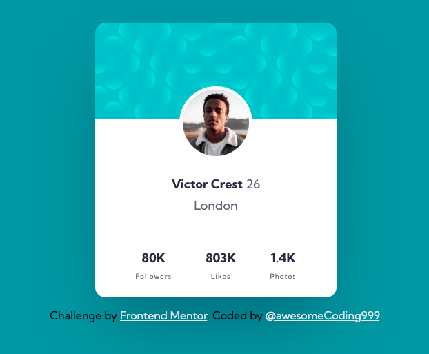

# Frontend Mentor - Profile card component solution<!-- omit in toc -->



## Table of contents<!-- omit in toc -->

- [Overview](#overview)
  - [The challenge](#the-challenge)
  - [Links](#links)
- [My process](#my-process)
  - [Built with](#built-with)
  - [What I learned](#what-i-learned)
- [Author](#author)

## Overview

### The challenge

- Build out the project to the designs provided

### Links

- [GitHub repo](https://github.com/awesomeCoding999/frontend-mentor-profile-card)
- [Live site URL](https://awesomecoding999.github.io/frontend-mentor-profile-card/)

## My process

### Built with

- Semantic HTML5 markup
- CSS custom properties
- Flexbox
- Mobile-first workflow

### What I learned

I learned how to work with multiple background images in the body and position them in different places.

```css
body {
  font-family: "Kumbh Sans", sans-serif;
  min-height: 100vh;
  display: flex;
  flex-direction: column;
  justify-content: center;
  align-items: center;
  background-color: var(--dark-cyan);
  background-image: url("./images/bg-pattern-top.svg"),
    url("./images/bg-pattern-bottom.svg");
  background-repeat: no-repeat no-repeat;
  background-position: left -700px top -600px, bottom -500px right -800px;
}
```

## Author

- Frontend Mentor - [@awesomeCoding999](https://www.frontendmentor.io/profile/awesomeCoding999)
